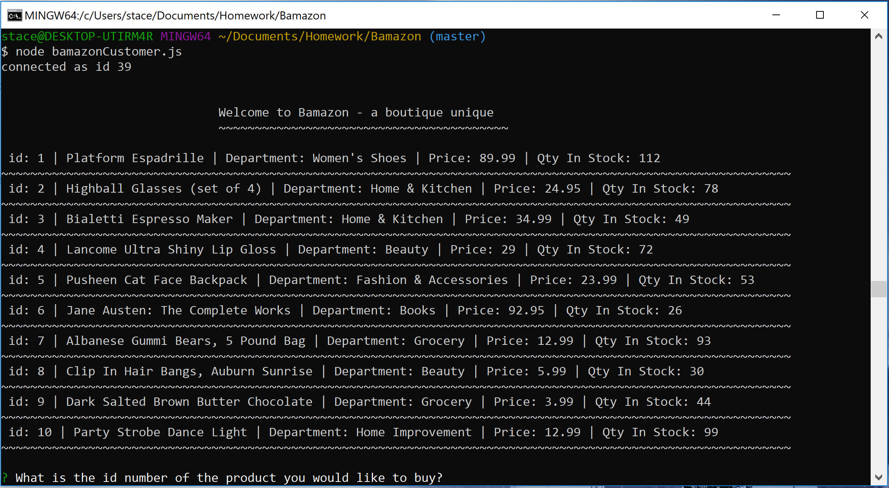
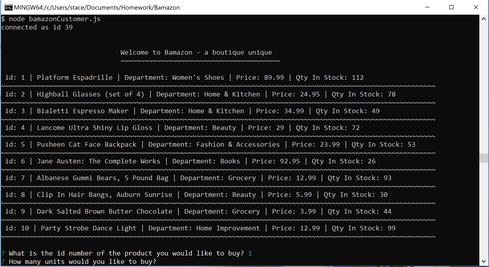
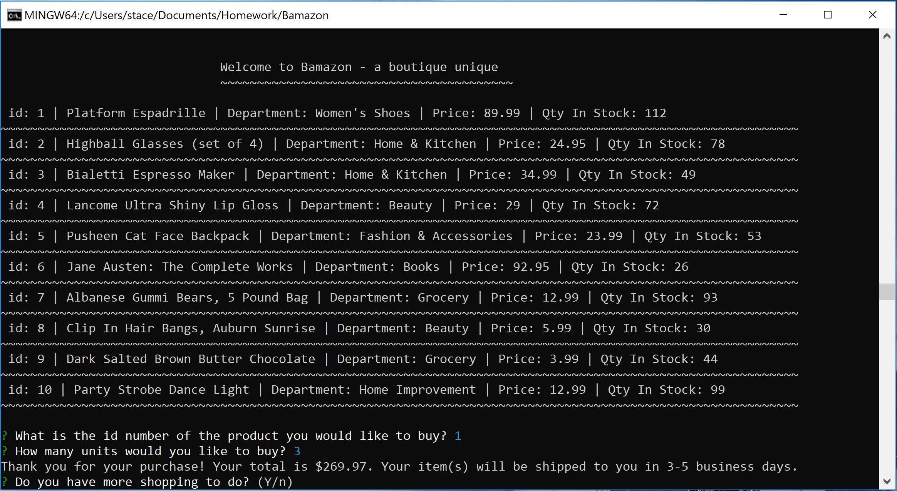
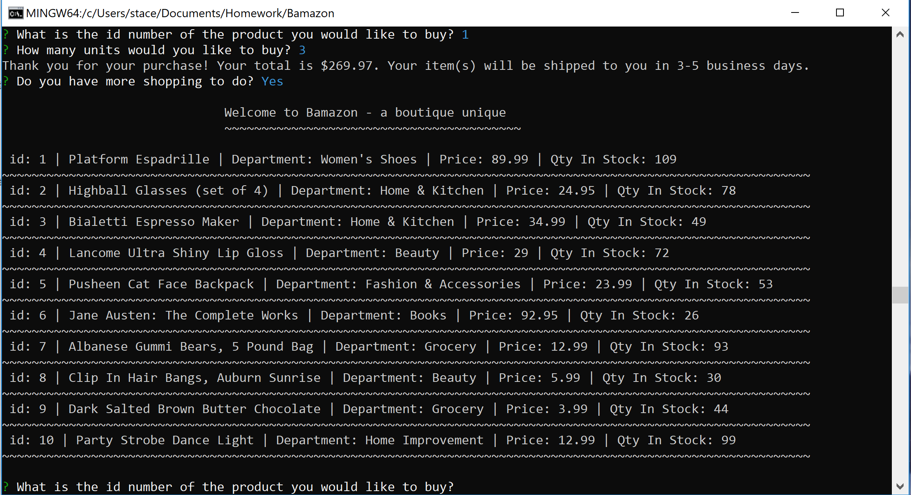
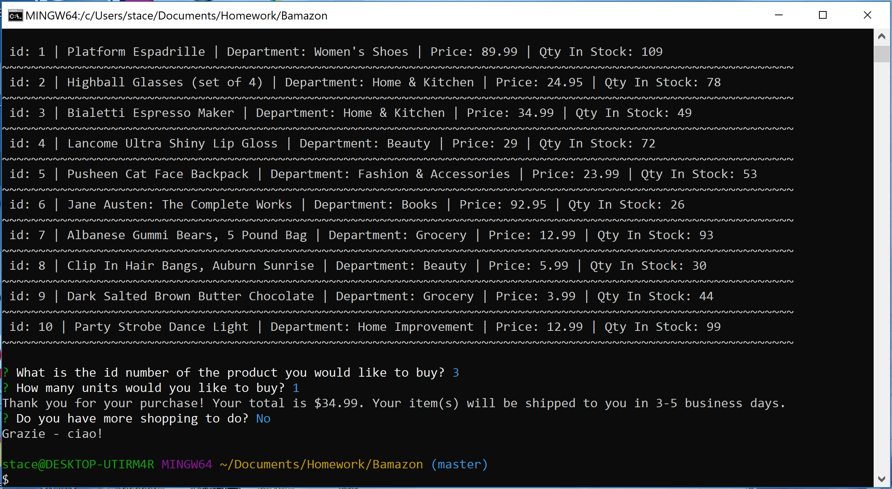

# Bamazon :moneybag: :credit_card: :handbag:

This node application allows the user to order items from a curated list of specialty goods in a mock online storefront interface.  The user will be prompted to select from a list of ten available items and enter the quantity desired for purchase.  If the quantity onhand is sufficient to fulfill the order, they will receive a success message with their total purchase price and they will be prompted to make another purchase.  If there is not enough inventory available, they will receive an informational message to try again tomorrow and then be prompted to make another purchase.  

All data for the store items is contained in a "products" table stored in mySQL.  The read functionality displays all items and the available quantities.  When the user completes a successful purchase, the update function subtracts the quantity on hand from the "products" table in real time.

# Node packages included:
- inquirer
- mySQL

# SQL:
Please reference the sql.txt file for all of the SQL commands used to create the "products" table.  

# Screenshots of use cases:

The product list displayed upon initial read function:

The quantity prompt after an item number has been entered:

The reprompt after an order has completed:

The user wishes to purchase additional items:

The user has finished shopping and exits:

